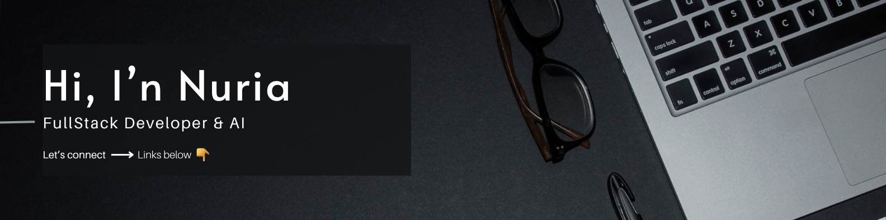

## 👋 Welcome!

I'm a **FullStack Developer specializing in AI**, passionate about building applications with real-world impact. I combine Backend development, AI techniques, and intuitive UI to create solutions that solve real problems.


### 🌍 Currently open to remote opportunities and collaborative tech projects.

----------


## 👩‍💻 About Me
```python
class Developer:
    def __init__(self):
        self.name = "Nuria Vázquez"
        self.current_role = "FullStack Developer & AI"
        self.languages = {
            "spanish": "Native",
            "english": "Professional"
        }
        self.currently_learning = [
            "Advanced Frontend development (React patterns, Next.js 15+)",
            "Modern UI libraries: shadcn/ui, Radix UI, Framer Motion",
            "AI/ML integration: Building AI agents",
            "System Architecture for scalable applications"
        ]
        self.interests = [
            "FullStack Development",
            "AI Data Science & Analytics"
        ]
        
    def say_hi(self):
        print("Thanks for stopping by! Let's build something amazing together 🚀")

me = Developer()
me.say_hi()
```


## 💻 Tech Stack

### 🧑‍💻 Programming Languages

<div>      </div>

### 🤖 AI & Big Data

<div>          </div>

### 🎨 Frontend

<div>     

### 🛠️ Backend

<div>      

### 🗃️ Databases

<div>   


### 🧰 Development Tools

<div>      </div>

### 🖥️ Operating Systems

  
 </div>


## 🤝 Let's Collaborate!

I'm always interested in:
- 🚀 Innovative tech projects with real-world impact
- 🤖 AI/ML applications and intelligent systems
- 💼 Remote opportunities (FullStack, Backend, AI roles)
- 🌍 Open source contributions
- 📚 Technical writing and knowledge sharing

**Feel free to reach out if you want to:**
- Collaborate on a project
- Discuss tech ideas and architectures
- Explore job opportunities

----------

## 📫 How to Reach Me

<div align="center">
  
[](https://linkedin.com/in/nuria-vazquez)
[](https://nuriavazquez.dev/en/)
[](https://dev.to/nuriadevs)
[](https://www.youtube.com/@nuriavazquezdev)

</div>

----------

<div align="center">
  
### ✨ Thanks for visiting! Happy coding! ✨

**⭐️ From [nuriadevs](https://github.com/nuriadevs) with 🍀**

</div>

