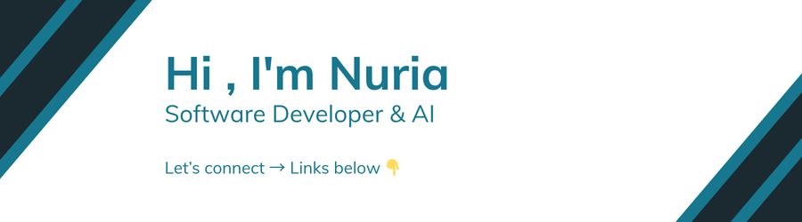

## 👋 Welcome!

I'm a **Junior Software Developer – FullStack & AI**, passionate about building applications with real-world impact. I enjoy combining Backend development, AI techniques, and intuitive UI to create user-friendly experiences.

### 🌍 Currently open to remote opportunities and collaborative tech projects.

----------

## 💻 Tech Stack

### 🧑‍💻 Programming Languages

      

### 🤖 AI & Big Data

        

### 🎨 Frontend

      

### 🛠️ Backend

        

### 🗃️ Databases

     

### 🎨 Design

   

### 🧰 IDEs & Editors

     

### 🖥️ Tools / OS

      

### 🌍 Remote Tools

    

----------

## 📫 Let's Connect!

Do you have an interesting idea or collaboration opportunity? I'd love to hear about it!

-   💼 **LinkedIn:** [nuria-vazquez](https://linkedin.com/in/nuria-vazquez)
-   📧 **Email:** [nuriadevs@gmail.com](mailto:nuriadevs@gmail.com)
-   🌐 **Website:** [nuriavazquez.dev](https://nuriavazquez.dev/)
-   🎥 **YouTube:** [@nuriavazquezdev](https://www.youtube.com/@nuriavazquezdev)

### Thanks for visiting my profile! 🚀